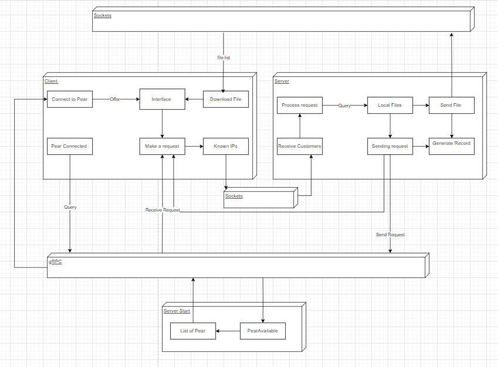
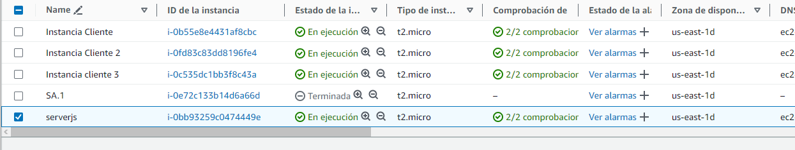
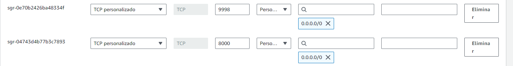

## ST0263 <Top. Telematica>
#
## Mateo Muñoz Cadavid, mmunozc4@eafit.edu.co
#
## Edwin Nelson Montoya Múnera , emontoya@eafit.edu.co
#

# Reto 1 y 2
#
## 1. breve descripción de la actividad

### 1.1. El desarrollo del reto ha resultado en la creación de un sistema P2P, aprovechando microservicios que se comunican a través de gRPC. Esta implementación ha permitido establecer una comunicación efectiva entre los pear de la red, sin depender de un servidor centralizado. Cada par se conecta exitosamente a un servidor de arranque (Pear #1), facilitando así el inicio y la organización de la red. Además, se ha logrado cumplir con todos los requisitos de despliegue y configuración en el entorno de AWS para las instancias de cada pear, garantizando un funcionamiento óptimo en dicho entorno.

### 1.2. Se han identificado varios aspectos que no se cumplieron completamente en la implementación del proyecto. En primer lugar, la funcionalidad de transferencia de archivos y la confirmación de dicha acción no fueron correctamente implementadas, lo que limita la capacidad del sistema para intercambiar datos entre los pears de la red de manera efectiva. Además, se observa una inconsistencia en la conexión entre los pears, con algunas instancias en las que la conexión no se establece correctamente.

## 2. 
### Se ha implementado una arquitectura basada en microservicios dentro de una red P2P, donde se hace uso del protocolo gRPC para facilitar la comunicación entre estos servicios. Esta elección de diseño pone un fuerte énfasis en la modularidad, permitiendo que cada microservicio funcione de manera independiente, lo que facilita su mantenimiento y escalabilidad. Además, gRPC ofrece una solución eficiente para la gestión de conexiones concurrentes, lo que mejora la capacidad del sistema para manejar múltiples solicitudes simultáneas de manera rápida y efectiva. Este enfoque técnico garantiza una arquitectura robusta y adaptable, adecuada para entornos distribuidos como una red P2P.

## 3. 
### Lenguaje de Programación y Librerías Utilizadas: El proyecto se desarrolla principalmente en Python, versión 3.x. Se emplean varias librerías y paquetes, incluyendo grpcio (v1.62.0) y grpcio-tools (v1.62.0) para la implementación de la comunicación gRPC, así como requests (v2.31.0) para otras operaciones de red. Además, se definen otras dependencias en el archivo requirements.txt.

### Compilación y Ejecución: La aplicación se ejecuta directamente utilizando Python. Para la compilación de archivos .proto y la generación de código gRPC, se emplea la herramienta grpcio-tools.

### Configuración del Proyecto: Los parámetros de configuración, como la dirección IP, el puerto y otros detalles específicos, se gestionan mediante archivos de configuración. Esta estructura permite una configuración flexible y adaptable a diferentes entornos de ejecución, facilitando así la gestión y la portabilidad del proyecto.

### Organizacion del sistema: 

### como se compila y ejecuta: Cliente: Compilación del Protocolo gRPC: Utiliza el comando específico para compilar el archivo .proto y generar los stubs necesarios para la comunicación gRPC. Instalación de Dependencias: Ejecuta pip install -r requirements.txt para instalar todas las dependencias especificadas. Ejecución del Cliente: Inicia el script main.py. Durante la ejecución, se solicitará ingresar la IP pública para conectarse al servidor de arranque.
### Servidor de Arranque: Instalación de Node.js: Sigue los pasos para instalar Node.js utilizando el comando adecuado.     Arranque del Servidor: Ejecuta sudo node main.js para iniciar el servidor, el cual escuchará en el puerto 8000.

### detalles técnicos: La ip, y los puertos se configuran por AWS, cada instancia siendo un pear diferente:

# 4. Descripción del ambiente de EJECUCIÓN (en producción) lenguaje de programación, librerias, paquetes, etc, con sus numeros de versiones.

### Guia de uso, y descripcion del ambiente de ejecucion: https://eafit-my.sharepoint.com/personal/mmunozc4_eafit_edu_co/_layouts/15/stream.aspx?id=%2Fpersonal%2Fmmunozc4_eafit_edu_co%2FDocuments%2FGrabaciones%2FReunión%20con%20Mateo%20Muñoz%20Cadavid-20240303_233007-Grabación%20de%20la%20reunión%2Emp4&nav=eyJyZWZlcnJhbEluZm8iOnsicmVmZXJyYWxBcHAiOiJTdHJlYW1XZWJBcHAiLCJyZWZlcnJhbFZpZXciOiJTaGFyZURpYWxvZy1MaW5rIiwicmVmZXJyYWxBcHBQbGF0Zm9ybSI6IldlYiIsInJlZmVycmFsTW9kZSI6InZpZXcifX0&ga=1&referrer=StreamWebApp%2EWeb&referrerScenario=AddressBarCopied%2Eview

### referencias:
### https://github.com/st0263eafit/st0263-241/blob/main/README.md
### https://grpc.io/docs/languages/python/basics/
